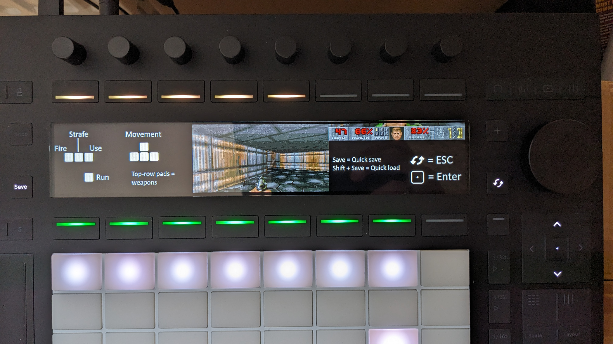
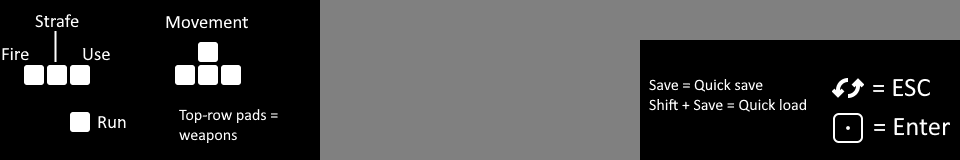

# AbleDOOM - Doom for Ableton Push Standalone!!

A port of Doom for Ableton Push, a standalone music making device.
Based on [doomgeneric](https://github.com/ozkl/doomgeneric).



[Demo Video](https://www.youtube.com/watch?v=Mk8t_wufi4k)

## Prerequisites

You need a copy of Doom, specifically a WAD file, and a Push Standalone unit with [SSH access configured](https://forum.ableton.com/viewtopic.php?t=248249).

I used `DOOM1.WAD` from the original DOS Shareware version, which is widely available for free.
The registered version or even Doom 2 should probably also work, but I haven't tested that.

⚠️ ⚠️ ⚠️ ⚠️ ⚠️

Be careful when using SSH access - doing something wrong could break your Push.
**Neither the authors of this code nor Ableton are responsible** for any problems or damage caused to your device as a result of using SSH access.
You're doing this **at your own risk**!
Only follow the steps outlined here if you understand this, agree with this, and accept full responsibility for any changes you make to your Push device.

⚠️ ⚠️ ⚠️ ⚠️ ⚠️

## Building

I used Ubuntu 22.04 (via WSL) for all of the steps described below. Adapt as needed for other Linux distributions.

First, install dependencies:

```bash
sudo apt install libsdl2-dev libsdl2-mixer-dev libusb-1.0-0-dev patchelf
```

Then, build the project:

```bash
cd doomgeneric
make -f Makefile.pushstandalone
```

If successful, this produces a binary called `doomgeneric`. However, this binary *won't* run on Push just yet. We first have to patch the interpreter path, as this is different on Push:

```bash
patchelf --set-interpreter /lib/ld-linux-x86-64.so.2 doomgeneric
```

Next, we can copy the binary over to Push and run the game.

## Copying everything onto Push

Make sure you have SSH configured on the device (see above).

Note: If `push.local` doesn't work, try using the unit's IP address.
You can find it via your network router's status page, for example.

I've created a dedicated directory `abledoom` on my unit, in the `ableton` user's home directory:

```bash
ssh ableton@push.local -C "mkdir abledoom"
```

After that, I copied over all the necessary files, starting with the binary and all required shared library dependencies that aren't already provided by the OS on Push:

```bash
DEST=ableton@push.local:abledoom

# Binary
scp doomgeneric "$DEST"

# Dependencies
scp /lib/x86_64-linux-gnu/libSDL2-2.0.so.0 "$DEST"
scp /lib/x86_64-linux-gnu/libSDL2_mixer-2.0.so.0 "$DEST"
scp /lib/x86_64-linux-gnu/libpulse.so.0 "$DEST"
scp /lib/x86_64-linux-gnu/libXss.so.1 "$DEST"
scp /lib/x86_64-linux-gnu/libwayland-egl.so.1 "$DEST"
scp /lib/x86_64-linux-gnu/libwayland-client.so.0 "$DEST"
scp /lib/x86_64-linux-gnu/libwayland-cursor.so.0 "$DEST"
scp /lib/x86_64-linux-gnu/libdecor-0.so.0 "$DEST"
scp /lib/x86_64-linux-gnu/libmodplug.so.1 "$DEST"
scp /lib/x86_64-linux-gnu/libfluidsynth.so.3 "$DEST"
scp /lib/x86_64-linux-gnu/libvorbisfile.so.3 "$DEST"
scp /lib/x86_64-linux-gnu/libFLAC.so.8 "$DEST"
scp /lib/x86_64-linux-gnu/libmpg123.so.0 "$DEST"
scp /lib/libopusfile.so.0 "$DEST"
scp /lib/x86_64-linux-gnu/pulseaudio/libpulsecommon-15.99.so "$DEST"
scp /lib/x86_64-linux-gnu/libjack.so.0 "$DEST"
scp /lib/x86_64-linux-gnu/libpulse-simple.so.0 "$DEST"
scp /lib/x86_64-linux-gnu/libsndfile.so.1 "$DEST"
scp /lib/x86_64-linux-gnu/libgomp.so.1 "$DEST"
scp /lib/x86_64-linux-gnu/libinstpatch-1.0.so.2 "$DEST"
scp /lib/x86_64-linux-gnu/libvorbis.so.0 "$DEST"
scp /lib/x86_64-linux-gnu/libopus.so.0 "$DEST"
scp /lib/x86_64-linux-gnu/libasyncns.so.0 "$DEST"
scp /lib/x86_64-linux-gnu/libapparmor.so.1 "$DEST"
scp /lib/x86_64-linux-gnu/libdb-5.3.so  "$DEST"
scp /lib/x86_64-linux-gnu/libvorbisenc.so.2  "$DEST"
```

⚠️ The list of required `.so` files depends on your concrete Linux distribution, version, etc. - it might very well be a different list on your machine.
The way I did it was to copy the binary over to Push and try to run it, see what library it complains about missing, and copy that.
Repeat the process until it runs.

Next, we also need to copy the WAD file of your choice (see above), and a Soundfont if you'd like music support.

I used the system-provided Soundfont, `TimGM6mb.sf2`:

```bash
scp /usr/share/sounds/sf2/TimGM6mb.sf2 ableton@push.local:abledoom
```

With everything in place, the `abledoom` directory should have the following content:

```bash
ableton@push:~/abledoom$ ls -l
total 21003
-rwxr-xr-x 1 ableton users 4196020 Jan 30 12:19 DOOM1.WAD
-rw-r--r-- 1 ableton users 5969788 Jan 30 12:48 TimGM6mb.sf2
-rwxr-xr-x 1 ableton users 1818968 Jan 30 12:19 doomgeneric
-rw-r--r-- 1 ableton users  239712 Jan 30 12:30 libFLAC.so.8
-rw-r--r-- 1 ableton users 1676536 Jan 30 12:30 libSDL2-2.0.so.0
-rw-r--r-- 1 ableton users  143544 Jan 30 12:30 libSDL2_mixer-2.0.so.0
-rw-r--r-- 1 ableton users   14680 Jan 30 12:30 libXss.so.1
-rw-r--r-- 1 ableton users   80768 Jan 30 12:30 libapparmor.so.1
-rw-r--r-- 1 ableton users   26616 Jan 30 12:30 libasyncns.so.0
-rw-r--r-- 1 ableton users 1760880 Jan 30 12:30 libdb-5.3.so
-rw-r--r-- 1 ableton users   35344 Jan 30 12:30 libdecor-0.so.0
-rw-r--r-- 1 ableton users  551240 Jan 30 12:30 libfluidsynth.so.3
-rw-r--r-- 1 ableton users  298776 Jan 30 12:30 libgomp.so.1
-rw-r--r-- 1 ableton users  765184 Jan 30 12:30 libinstpatch-1.0.so.2
-rw-r--r-- 1 ableton users  339912 Jan 30 12:30 libjack.so.0
-rw-r--r-- 1 ableton users  329944 Jan 30 12:30 libmodplug.so.1
-rw-r--r-- 1 ableton users  372280 Jan 30 12:30 libmpg123.so.0
-rw-r--r-- 1 ableton users  378952 Jan 30 12:30 libopus.so.0
-rw-r--r-- 1 ableton users   51168 Jan 30 12:30 libopusfile.so.0
-rw-r--r-- 1 ableton users   22760 Jan 30 12:30 libpulse-simple.so.0
-rw-r--r-- 1 ableton users  343240 Jan 30 12:30 libpulse.so.0
-rw-r--r-- 1 ableton users  538960 Jan 30 12:30 libpulsecommon-15.99.so
-rw-r--r-- 1 ableton users  508456 Jan 30 12:30 libsndfile.so.1
-rw-r--r-- 1 ableton users  178248 Jan 30 12:30 libvorbis.so.0
-rw-r--r-- 1 ableton users  694408 Jan 30 12:30 libvorbisenc.so.2
-rw-r--r-- 1 ableton users   38904 Jan 30 12:30 libvorbisfile.so.3
-rw-r--r-- 1 ableton users   64776 Jan 30 12:30 libwayland-client.so.0
-rw-r--r-- 1 ableton users   35352 Jan 30 12:30 libwayland-cursor.so.0
-rw-r--r-- 1 ableton users   14368 Jan 30 12:30 libwayland-egl.so.1
```

Now, we're ready to run the game!

## Running it

First, stop the Ableton Push software from running:

```bash
ssh root@push.local -C "killall XPython3Exe && killall Live && killall Push3"
```

To restore regular functionality, reboot the system (`reboot` command via SSH as `root`.)

A few environment variables need to be set in order to run the game correctly.
You can use the file `run_it.sh` at the root of this repository, which takes care of everything.
⚠️If you do, make sure to adjust the name of the WAD file in case yours is called differently than `DOOM1.WAD`.

```bash
# Copy the launch script to Push
scp run_it.sh ableton@push.local:abledoom

# Go!
ssh ableton@push.local -C "cd abledoom && ./run_it.sh"
```

If you'd prefer to launch manually, here's everything needed with some explanation:

```bash
# This tells ALSA to use the Push's headphone jack as audio output
export AUDIODEV=plughw:1,0

# Make sure we use ALSA
export SDL_AUDIODRIVER=alsa

# Make sure the correct Soundfont is loaded
SDL_FORCE_SOUNDFONTS=1
SDL_SOUNDFONTS=TimGM6mb.sf2

# Make sure the bundled dependencies are found
LD_LIBRARY_PATH=.

# Run Doom using the provided WAD file
./doomgeneric -iwad DOOM1.WAD
```

## Controls



* `Save` button: Quick save (+Shift: quick load)
* `Swap` button: Escape (open menu)
* D-pad center button: Enter (make a choice in menu)
* Top-row of pads: Weapon selection (like the number keys on a keyboard)
* Middle-left cluster on pads: Fire, Strafe, Use, Run (like Ctrl, Alt, Space, and Shift)
* Middle-right cluster on pads: Movement (like arrow keys on a keyboard)
* The buttons around the screen are used to display your health and armor. The scene launch buttons show ammunition for the current weapon.

